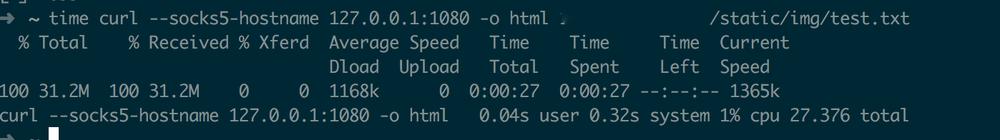

### 简介

本程序仅仅是加速，不是vpn，目前须搭配kcptun使用。程序的目的是，防止isp对udp流量的qos。目前仅支持mac（包括其他Unix）和Linux。kcptun的简介和使用见[这里](https://github.com/xtaci/kcptun).

下面用一张图片简要说一下原理

### 安装指南

64位Linux和64位Mac已经预编译好了。可以直接下载二进制。点击[这里](https://github.com/iceonsun/rsock/releases).

其他平台可以自己下载源码进行编译。rsock依赖的第三方库有：libuv, libnet, libpcap。

以ubuntu为例：
`sudo apt-get install g++ libuv1-dev libnet libpcap # 注意是libuv1-dev
git clone https://github.com/iceonsun/rsock.git rsock
cd rsock
mkdir build && cd build
cmake .. -DRSOCK_RELEASE=1 && make`

为了加快编译速度，make可以指定-j，后跟cpu核数。如：make -j2

### 使用说明

#### 服务器

以64位linux为例：

`sudo ./server_rsock_Linux --dev=eth0 --taddr=127.0.0.1:9999 --ports=10000-10005 --daemon=1`

参数解释:

eth0，外网网卡名称。

127.0.0.1:9999 ，目标地址，即kcptun服务端工作的ip和端口。

10000-10005 ，是rsock服务器端工作的端口**范围**。 形式可以这样, 
10000-10005，表示会占用从端口10000到10005(总共6个）。也可以分别指出试用哪个几个端口，80,443,8080（总共3个）, 表示分别使用这几个端口。也可以同时使用两种表示方法: 80,443,10000-10005（总共8个）.

daemon 等于1表示以守护进程运行程序。为0表示前台。推荐指定为1.

#### 客户端

以mac为例：

`sudo ./client_rsock_Darwin --dev=en0 --taddr=x.x.x.x --ports=10000-10005 --ludp=127.0.0.1:30000 --daemon=1`

参数解释：

en0，外网网卡名称。对于mac，如果连的是wifi，一般是en0。如果是有线，一般是eth1。

taddr，rsock服务器端地址。注意，这里和服务器端不一样：只需指定ip地址。

ports 表示服务端rsock工作的端口**范围**。同上。

ludp 是本地监听的udp端口。即kcptun客户端的目标地址(kcptun中-t 参数对应的地址）。

daemon 同上。

### 退出运行

`ps axu|grep rsock`

`sudo kill -SIGUSR1 pid # 其中pid是rsock运行的进程id, 图中是72294`

### 原理

1. 服务器首先会监听一系列的端口
2. client连接上这些端口
3. 客户端通过libnet发送数据到服务器任一端口（初始的tcp.seq 和 tcp.ack 是根据tcp三步握手抓取来的）
4. 服务端通过libpcap接收数据。服务端往客户端发送数据也是一个原理。这样就完成了通信。
5. 对应用层来说，一个连接是local_ip:app_udp_port <-> server_ip:app_udp_port。如果在30s之内检测到这条连接没有数据通信，就会关闭这条连接.
6. 当client接收到rst或者fin的时候，会关闭这条真正的网络连接，重新connect服务器。再进行通讯。

#### 缺点

由于数据的收费并没有通过创建的socket来进行，而是通过libnet,libpcap，会造成每一次收到对方传来的数据，都会向peer端发送一个长度为0的包。其中ack是socket所期望的下一个对方传过来的seq。这样就会造成带宽的浪费。

### 对比

对比对象：rsock, [udp2raw-tunnel](https://github.com/wangyu-/udp2raw-tunnel)、[kcptun](https://github.com/xtaci/kcptun)

##### 服务器端测试环境

digitalocean纽约机房。1G RAM

##### 客户测试环境1：digitalocean新加坡机房。墙外<->墙外

rsock(tcp only)的下载速度. 稳定在700KB左右

rsock(udp only)的下载速度。稳定在1M左右

rsock(tcp and udp)的下载速度。稳定在900K左右

udp2raw-tunnel. 很快。1360KB。

kcptun. kcptun速度最快。1600KB

#####  客户测试环境1：国内某电信宽带。100Mb下行10Mb下行。墙内<->墙外

rsock(tcp only)的下载速度. 速度稳定在630KB左右。

rsock(udp only)的下载速度。稳定在1MB左右

rsock(udp and tcp)的下载速度. 在700KB左右

kcptun的下载速度. 速度在2M左右。

由于mac平台上没搞清楚udp2raw虚拟机咋弄，暂时没有测试udp2raw-tunnel。

#### 结论
可以看到，rsock目前的速度只有kcptun 30%-50%。不过这个速度看youtube 1080p足够了。无快进的境况下，不会出现缓冲。但是如果快进，还是会缓冲几秒，这个在与kcptun对比的时候，比较明显。

### 注意事项

如果有的时候发现不能上网了，请检查是rsock挂掉了还是kcptun挂掉了.可以运行下面的命令来检查：

`ps axu|egrep 'kcptun|rsock'`

强烈建议服务端kcptun和服务端rsock在后台运行。对于kcptun来说，运行：

`nohup sudo -u nobody ./server_linux_amd64 -r ":port1" -l ":port2" -mode fast2 -key aKey >/dev/null 2>&1 &`

对于rsock，只需在参数中添加 `--daemon=1`

### TODO

1. 定位速度远慢于kcptun的原因。
   - 虽然kcptun走了rsock流量，会造成速度变慢一点，但我觉得这不是rsock速度远慢于kcptun的主要原因。目前还不清楚中间的路由器/防火墙会不会根据tcp的seq和ack丢包。
   
   - 会不会是由于libuv调度的问题，产生瞬间的接收/发送流量，从而导致丢包。
   
2. 如果速度慢的问题是长度为0的ack，那么可以考虑使用Linux rawsocket，BSD bpf分组过滤。

### 捐赠

非常欢迎。

微信打赏

比特币

11451A1Y4e8vtK3Jb7DoW8BTqj1afuWSn8

或者扫描二维码

以太币

0x648419aE3D49271BB7cC31F2a61bC4c517Ea6578

或者扫描二维码

