[](https://travis-ci.org/iceonsun/rsock) [](https://ci.appveyor.com/project/iceonsun/rsock)

---

### 简介

rsock仅仅不是加速（加速目前由kcptun进行），也不是vpn，而是把udp流量转换成多条**伪tcp/正常udp**流量。 rsock和udp类似，传输的数据是不可靠的，也没有流控，超时重发等算法，所以目前须搭配kcptun使用或者其他有ARQ机制的udp程序使用。rsock的目的是，防止isp对udp流量的qos。目前仅支持mac（包括其他Unix）和Linux。kcptun的简介和使用见[这里](https://github.com/xtaci/kcptun)。 shadowsocks的简介见[这里](https://github.com/shadowsocks/shadowsocks-go) 。

再强调一次，rsock的传输是**不可靠的**，可靠的传输由app层负责。

下面用一张图片简要说一下原理

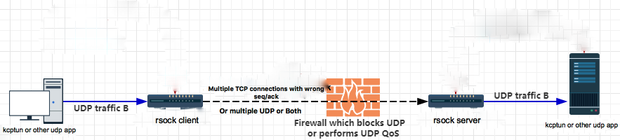

### 安装指南

64位Linux、64位Mac还有Windows已经预编译好了。可以直接下载二进制。点击[这里](https://github.com/iceonsun/rsock/releases).

Windows需要安装winpcap. 点击[这里](https://www.winpcap.org/install/default.htm) 。

其他平台可以自己下载源码进行编译。rsock依赖的第三方库有：libuv, libnet, libpcap。编译指南在[这里](https://github.com/iceonsun/rsock/wiki/%E7%BC%96%E8%AF%91%E6%8C%87%E5%8D%97)


### 快速指南

#### 服务器

注意防火墙，允许端口进入.
以64位linux为例：

```
# port=10001
# while [ $port -le 10010 ]
do
sudo ufw allow $port
port=$[ $port + 1]
done
```

表示允许客户端连接从10001到10010的端口。(**rsock服务端默认使用10001-10010，共10个端口。如果想修改默认端口范围，请见下面的参数详解。**)

`sudo ./server_rsock_Linux -t 127.0.0.1:9999`


参数解释:

-t 127.0.0.1:9999 ，目标地址，即kcptun服务端工作的ip和端口。

#### 客户端

以mac为例：

`sudo ./client_rsock_Darwin --taddr=x.x.x.x -l 127.0.0.1:30000`

参数解释：

-t x.x.x.x，替换成rsock服务器端地址。注意，这里和服务器端不一样：无需指定端口。

-l 127.0.0.1:30000 是本地监听的udp端口。即kcptun客户端的目标地址(kcptun中-t 参数对应的地址）。

#### 注意

1. 如果rsock不能正常工作，请检查你的网卡是否支持winpcap工作。路由器也有可能过滤掉包(特别是windows系统）。

2. 在Windows系统上，rsock的速度要远慢于mac/linux上。我测试的情况是，速度在500-800KB/s之间。举个例子：Linux和Mac用户，可以流畅的观看1080P youtube。Windows用户只能看720P，1080P会有点卡。

### 退出运行

`ps axu|grep rsock`

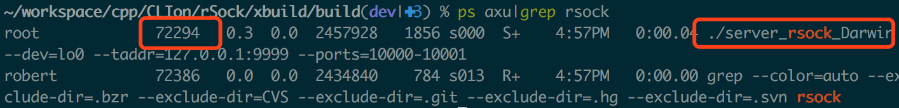

`sudo kill -SIGUSR1 pid # 其中pid是rsock运行的进程id, 图中是72294`

### 参数详解
```

	-t, --taddr=[addr]		目标地址。如：8.8.8.8:88, 7.7.7.7。必须指定。
	-l, --ludp=[addr]		本地监听的udp地址。仅客户端有效。客户端必须指定。
	-d, --dev=[device]		外网网卡地址。如, eth0, en0, eth1。rsock可以自动检测合适的网卡。当检测的网卡不能正常工作时，可以指定这个参数。
	-h, --help			显示帮助菜单. macOS暂时不可用
	-f				json配置文件
	--lcapIp=[ip]			外网ip。如果指定了这个参数，可以不指定 -d. 当检测的网卡不能正常工作时，可以指定这个参数。
	--unPath			本地监听的unix域套接字地址。暂时不可用
	-p, --ports=[...]		服务器端使用的tcp/udp端口。如：10001,10010(2个） ; 10001-10010(11个）; 80,443,10001-10010(12个)。中间无空格。 默认值：10001-10010
	--duration=[timeSec]		一段duration时间内，app连接如果无数据通信，会被关闭。单位秒。默认30s
	--hash=[hashKey]		不是用来加密的。只是用来判断是否属于本程序的特征。再重复一次， 数据的加密由kcptun进行）
	--type=[tcp|udp|all]		通信的方式。可以选择tcp，udp或者all。默认是tcp。
	--daemon=[1|0]			是否以后台进程运行。1是，0否。默认是1。
	-v				verbose模式。（最好不要改变默认值，目前有个未解的bug，会造成速度慢）
	--log=[path/to/log]		日志文件的目录地址。如果没有则会新建。默认是/var/log/rsock
	--cap_timeout			libpcap抓包的超时时间。默认10ms。除非你知道是什么意思，否则不要改动。

```

### 原理

1. 服务器首先会监听一系列的端口(默认tcp，范围10001到10010，共10个端口）
2. client会正常连接上这些端口(全部连接）
3. 对于一次通信，客户端通过libnet发送数据到服务器任一端口（初始的tcp.seq 和 tcp.ack 是根据tcp三步握手抓取来的），该端口必须是已经和客户端建立好了连接。
4. 服务端通过libpcap接收数据。服务端往客户端发送数据也是一个原理。这样就完成了通信。
5. 对应用层来说，一个连接是local_ip:app_udp_port <-> server_ip:app_udp_port。如果在30s之内检测到这条连接没有数据通信，就会关闭这条连接.
6. 当client接收到rst或者fin的时候，会关闭这条真正的网络连接，重新connect服务器。再进行通讯。

#### 缺点

由于数据的收发并不是通过创建的socket来进行，而是通过libnet,libpcap，会造成每一次收到对方传来的数据，都会向peer端发送一个长度为0的包。其中ack是socket所期望的下一个对方传过来的seq。这样就会造成带宽的浪费。

### 对比

对比对象：rsock、[kcptun](https://github.com/xtaci/kcptun)

##### 服务器端测试环境

digitalocean纽约机房。1G RAM


##### 客户测试环境1：digitalocean新加坡机房。墙外<->墙外

rsock(tcp only, 2个端口)的下载速度. 稳定在700KB左右

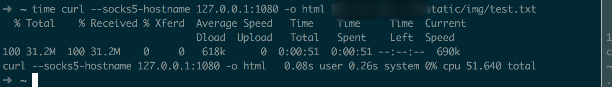

rsock(udp only，2个端口)的下载速度。稳定在1M左右


rsock(tcp and udp，各2个端口)的下载速度。稳定在900K左右

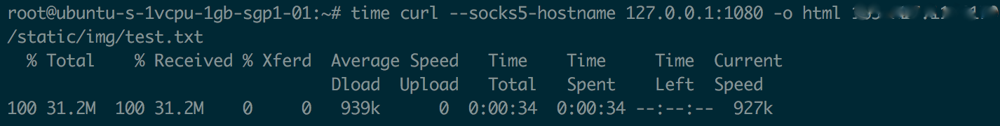

rsock(tcp only, 11个端口）的下载速度. 1.25M

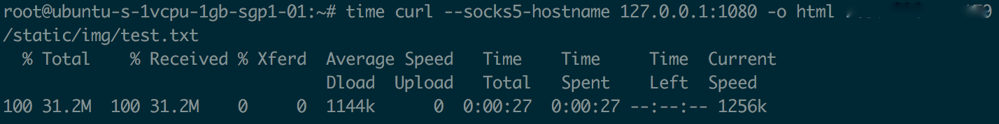

rsock(udp only, 11个端口)的下载速度.  1.5M

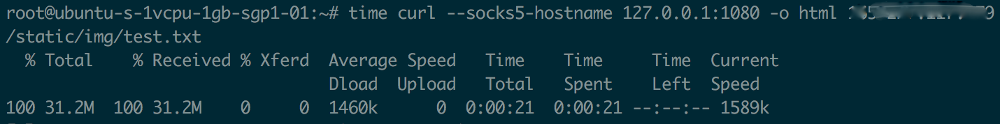

rsock(tcp and udp, 各11个端口）的下载速度. 1.1M


kcptun. kcptun速度最快。1600KB

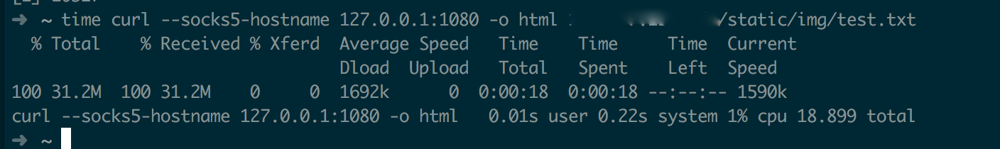


#####  客户测试环境1：国内某电信宽带。100Mb下行10Mb下行。墙内<->墙外

rsock(tcp only，2个端口)的下载速度. 速度稳定在630KB左右。

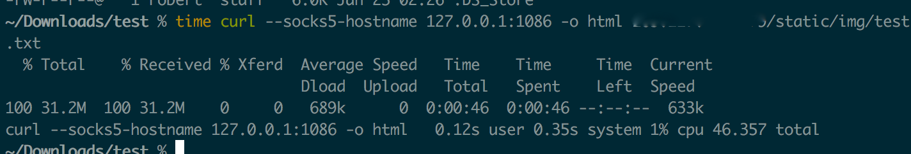

rsock(udp only，2个端口)的下载速度。稳定在1MB左右

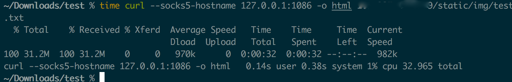

rsock(udp and tcp，各2个端口)的下载速度. 在700KB左右

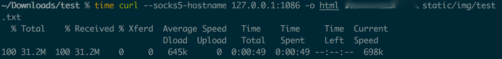

rsock(tcp only, 11个端口）的下载速度，稳定在1.4M左右。

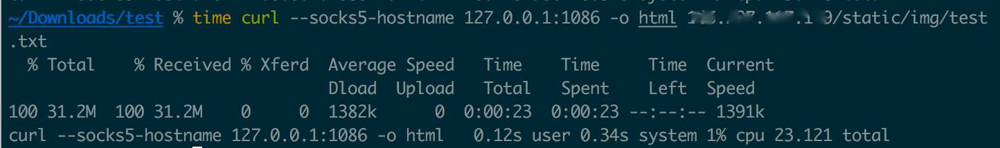

rsock(udp only, 11个端口）的下载速度，稳定在1.7M左右。

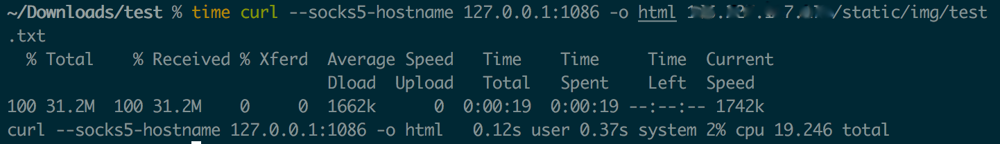

rsock(udp and tcp, 各11个端口）的下载速度，稳定在900K左右. 没错，我测试了2次，速度的确变小了。

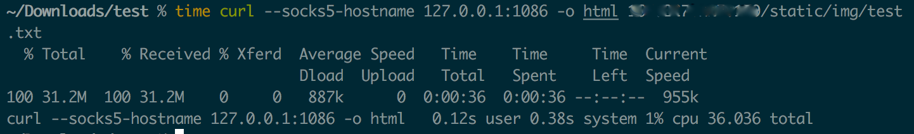

kcptun的下载速度. 速度在2M左右。

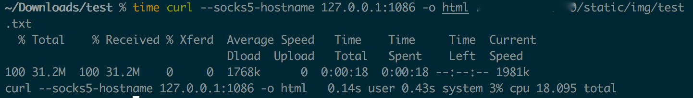

#### 结论
可以看到，rsock目前的速度只有kcptun 70%-90%。在看youtube 1080p快进的时候，感觉还是会比kcptun慢1s的样子. 

注意：并**不是**使用端口越多越好。主要还是受带宽影响。 经过测试，使用5个端口和10的端口的效果，差别不大。

### 注意事项

如果有的时候发现不能上网了，请检查是rsock挂掉了还是kcptun挂掉了.可以运行下面的命令来检查：

`ps axu|egrep 'kcptun|rsock'`

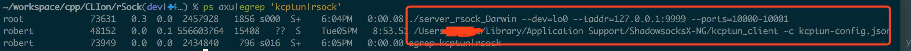

强烈建议服务端kcptun和服务端rsock在后台运行。对于kcptun来说，运行：

`nohup sudo -u nobody ./server_linux_amd64 -r ":port1" -l ":port2" -mode fast2 -key aKey >/dev/null 2>&1 &`

如果都在正常运行，可以重启kcptun的客户端(turn shadowsocks off/turn，这样包括重启了kcptun）。

**rsock没有对data进行加密**，因为加密一般都在app层（kcptun）中做了。

### 其他参考

[udp2raw-tunnel](https://github.com/wangyu-/udp2raw-tunnel)

[kcptun-raw](https://github.com/Chion82/kcptun-raw)

[icmptunnel](https://github.com/DhavalKapil/icmptunnel)


### TODO
  
1. 代码重构

1. 增加随机端口监听。

1. 增加闲置模式。当没有数据通过的时候，不要一直重连服务器。

1. 添加其他通信方式。比如: ICMP, DNS

### 捐赠

非常欢迎。

比特币

11451A1Y4e8vtK3Jb7DoW8BTqj1afuWSn8

或者扫描二维码


以太币

0x648419aE3D49271BB7cC31F2a61bC4c517Ea6578

或者扫描二维码


